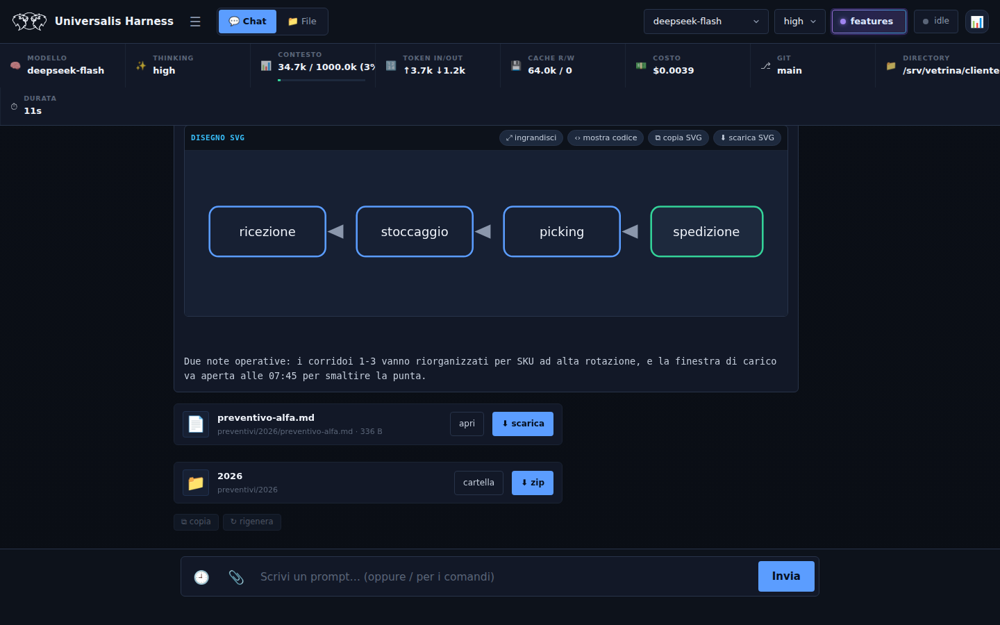
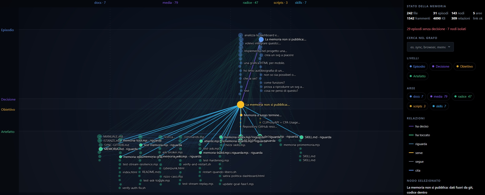
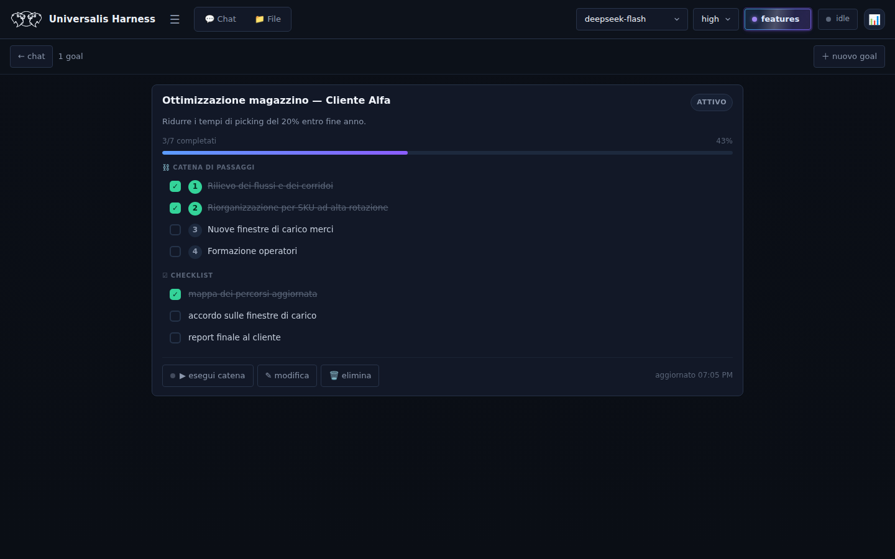
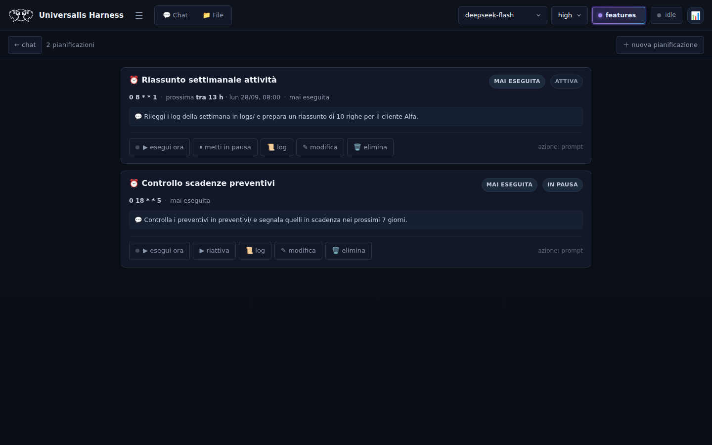
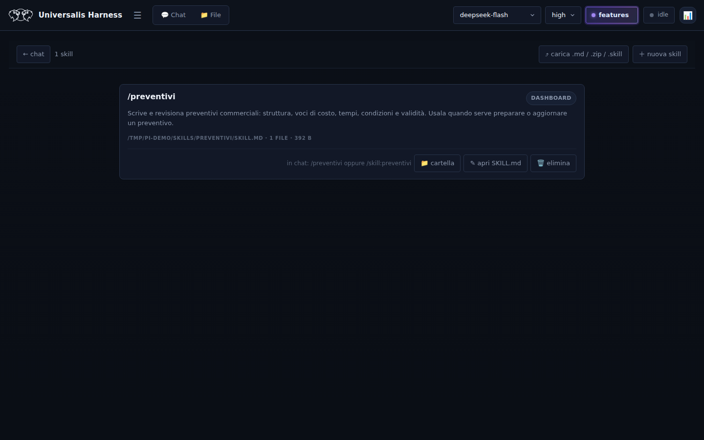
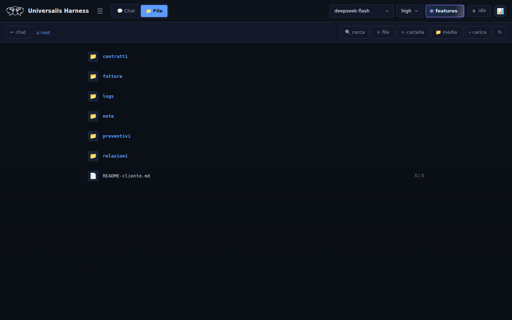
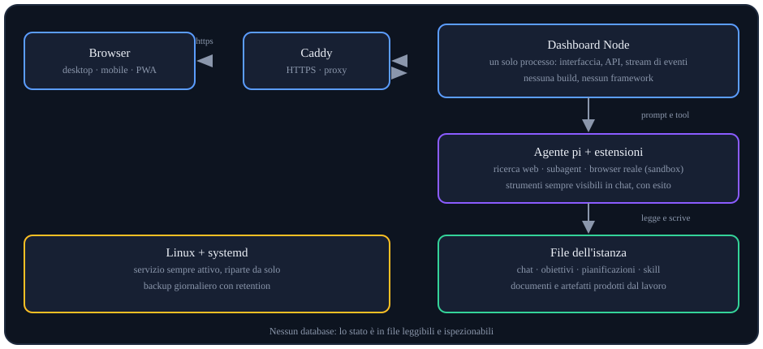

# Universalis Harness

**Un agente AI che lavora sui tuoi file, non solo in una chat.** Dashboard web self-hosted: chat
con tracciamento completo della spesa, file manager, obiettivi con catena di passaggi,
pianificazioni automatiche, skill riutilizzabili e un browser pilotato dall'agente — con la
possibilità di prendere il controllo quando serve un passaggio umano.

Nato come strumento di lavoro reale e usato ogni giorno in produzione, non come demo.

---

## Cosa fa

**Chat agentica trasparente.** Ogni turno mostra pensiero, testo e chiamate ai tool *nell'ordine
reale*, con l'esito di ognuna. La barra in alto dice sempre modello, livello di ragionamento,
contesto occupato, token in ingresso/uscita, cache, **costo della sessione**, branch git e durata.
Niente scatole nere: quando una risposta costa più del previsto, si vede.

**File come cittadini di prima classe.** I file prodotti o letti dall'agente compaiono in chat come
card con *apri* e *scarica*; le cartelle si scaricano come `.zip`. Il file manager naviga, modifica,
carica, cerca nel contenuto (con salto alla riga trovata) e si aggiorna da solo quando l'agente
scrive.

**Obiettivi e pianificazioni.** Un obiettivo è una catena di passaggi più una checklist, con
avanzamento e un pulsante che manda all'agente i passaggi rimanenti. Le pianificazioni cron fanno
girare prompt o obiettivi in autonomia, con esito, durata e log consultabili.

**Il progetto sono le cartelle che scegli tu.** Segni una o più cartelle con la stella nella vista
File e diventano *il progetto*: la vista 📦 le mostra con i loro file (una è quella attiva) e
**l'agente le riceve nel suo contesto** — sa dove sono, cosa contengono e su quale stai lavorando,
quindi «lavora sul progetto» ha un significato senza doverlo rispiegare.

**Immagini che si vedono e si capiscono.** L'agente *vede* le foto e gli screenshot che gli indichi
e le **mostra nella risposta** con un blocco dedicato: anteprima nel punto del messaggio, con nome,
formato, pixel reali, didascalia e un clic per aprirla a schermo intero. Il formato è verificato dal
server sui magic number (un HTML rinominato `.png` viene rifiutato), si mostrano solo file locali
(niente richieste a siti terzi mentre leggi) e per le immagini trovate sul web l'agente le scarica
prima in `media/` e cita la fonte. Il **lettore** nella vista File ha galleria, zoom (rotellina,
doppio tocco, due dita), rotazione, schermo intero e scorciatoie da tastiera.

**Documenti PDF che si aprono e si leggono.** Un cliente carica una fattura, un estratto conto, un contratto: la dashboard li **mostra** (prima pagina nella card, poi lettore a pagine con zoom, schermo intero e tastiera) e l'agente li **legge** — una pagina alla volta, una fascia, o cercando dentro («dove sta la scadenza?») — senza incollare centinaia di pagine nel contesto e senza mandarle fuori. Un documento scansionato, che testo non ne ha, si guarda come immagine e lo dichiara. Il testo estratto arriva sempre marcato come **materiale da leggere, non istruzioni da eseguire**.

**Disegni dentro la risposta.** Se il modello spiega con uno schema, il blocco SVG diventa un
disegno vero nel punto esatto del messaggio — con vista ingrandita, copia e download — dopo il
passaggio in un sanitizzatore che rifiuta script, risorse esterne e riferimenti di rete.

**Un decisore locale, acceso a richiesta.** Dove serve un giudizio ripetibile con una probabilità —
instradare una richiesta, dire se un input è ostile, scegliere fra azioni, dare una priorità —
l'harness può accendere dal menu *features* un decisore tipizzato locale — **Decision_M** (4B su CPU):
risponde a domande sì/no, scelta e punteggio **senza generare un token** e senza mandare nulla
fuori. Si accende quando serve e si spegne quando non serve, perché costa ~5,7 GB di RAM; l'agente
può proporne l'uso e chiederne il consenso, mai deciderlo da solo.

**Memoria a lungo termine, senza rileggere tutto.** L'harness ricorda il lavoro fatto — episodi,
decisioni, file toccati, obiettivi — e lo rende consultabile a tre costi diversi: il **grafo**
(struttura: nomi e relazioni, ~300 token), la **wiki** (una pagina per nodo) e la **ricerca** a
frammenti con un giudizio di confidenza che, quando la memoria non sa, lo dice. Gli episodi nascono
da sé a fine turno e alla compattazione del contesto — dove il riassunto che il modello ha già pagato
smette di sparire con la sessione; il *perché* lo scrive l'agente, ed è l'unica cosa che i file non
contengono. La scheda **Memoria** (accanto a Chat e File) disegna il grafo come **mappa 2D** — righe = livelli
(episodio → decisione → obiettivo → artefatto), colonne = progetti — con pan/zoom, nomi leggibili e
focus sul vicinato; una seconda lettura in **orbita 3D** mostra la forma d'insieme. Canvas scritto a
mano, zero librerie, deterministico: così i **buchi** si vedono — una fascia o una colonna vuota è un
progetto di cui non si registra nulla. I dati non si pubblicano mai: il repository è pubblico
([docs/MEMORIA.md](docs/MEMORIA.md)).

*La scheda Memoria: la mappa è la lettura da cui si parte — righe = livelli della memoria, colonne =
progetti, e con un nodo scelto il resto si attenua per lasciare in evidenza solo il suo vicinato*.

**Context engineering, in pratica.** La memoria non è un archivio da rileggere: è la scelta di
*quanto* contesto pagare per rispondere. Ogni accesso ha un prezzo dichiarato — ~300 token per la
struttura del grafo, ~500 per la pagina di wiki, qualche centinaio per i frammenti pertinenti — e chi
legge sa sempre **da dove viene** la risposta (`[episodio]`, `[codice]`, `[media]` = fatti registrati;
`[skill]`, `[harness]` = documentazione) e **quanto fidarsi** (alta / media / bassa / nessuna).
Quando la memoria non sa, lo dice: alla domanda «ricetta della carbonara» risponde che i termini
compaiono solo in documentazione, non in un episodio. Il resto si registra da sé — richieste, file
toccati, costi, errori, il riassunto della compattazione — così il contesto di ieri non va perso e
non va ripagato.

**Skill riutilizzabili** nel formato aperto *Agent Skills* (`SKILL.md`): si creano, si importano da
`.zip` e si usano come procedure stabili, con il modello che le legge solo quando il compito
corrisponde.

**Browser pilotato.** L'agente apre siti reali, legge l'albero di accessibilità, clicca e compila
moduli in un Chrome headless con sandbox verificata. Nella vista *live* lo guardi lavorare e, se
serve un 2FA o un CAPTCHA, prendi il controllo: la chat resta accanto alla pagina. Da telefono il
riquadro si ingrandisce (1:1 e 2×) o va a schermo intero, perché una pagina ridotta a un francobollo
non si legge.

**Domande all'utente invece di supposizioni.** Quando una richiesta è ambigua, l'agente pone la
domanda *dentro la conversazione*, con opzioni concrete e scadenze esplicite, e aspetta la risposta.

| Obiettivi | Pianificazioni | Skill | File |
|---|---|---|---|
|  |  |  |  |

## Due modi di usarlo

**1. Istanza ospitata** — il cliente usa la dashboard nel browser; l'istanza vive su un server
gestito. Ogni istanza ha cartella, credenziali e configurazione proprie, e può essere **limitata**:
quota disco con avviso *prima* del tetto fisico, modello bloccato, livelli di ragionamento
disabilitabili, sandbox di sistema più stretta per l'utente non privilegiato. È il modo in cui il
prodotto è già usato per un sottocliente.

**2. Installazione on-premise** — su una macchina del cliente, per chi ha vincoli propri (dati in
casa, rete chiusa, integrazioni interne). Tutto sta in una cartella: nessun servizio esterno, nessun
database, nessuna dipendenza cloud.

## Per chi è

- **professionisti e piccole strutture** che vogliono un agente che tocchi davvero i propri file e
  documenti, senza montare una piattaforma;
- **team tecnici** che vogliono un'interfaccia web sopra un agente a riga di comando, con costi
  sotto controllo;
- **chi ospita per altri**: una istanza per cliente, isolate, con limiti misurabili.

## Com'è fatto

Un solo processo Node serve la dashboard (HTML, CSS e JavaScript in un file, senza build) e le API.
Caddy mette HTTPS davanti e non comprime lo stream degli eventi; systemd tiene su il servizio e fa i
backup. L'agente è `pi` con le sue estensioni: accesso web, subagent, browser. Nessun database: chat,
obiettivi, pianificazioni e skill sono file leggibili.

## Sicurezza e limiti dichiarati

| Garantito | Come |
|---|---|
| Accesso protetto | login con cookie firmato (HMAC) **o** Basic Auth; blocco progressivo dopo tentativi falliti; HTTPS obbligatorio in produzione |
| CSRF | le scritture da cookie sono accettate solo dall'origine dell'applicazione |
| Perimetro dei file | percorsi confinati nella root, `..` e link simbolici che ne escono bloccati — anche nello `.zip` di una cartella |
| Contenuto non attendibile | l'SVG del modello passa da un sanitizzatore con whitelist e viene reso come immagine, mai nel DOM |
| Browser | sandbox di Chrome verificata prima di ogni azione, utente di sistema dedicato, nessuna shell |
| Segreti fuori dal codice | credenziali in `.env` con permessi ristretti, segreto di sessione in file separato, esclusi dal versionamento |

**Limiti, detti chiaramente.** L'agente ha accesso a una shell e ai file della root dell'istanza:
il confine di sicurezza è la macchina (o il container) su cui gira, non l'applicazione. Il modello di
accesso è pensato per **una persona per istanza** (utente e password), non per organizzazioni con
ruoli e permessi. Nella modalità ospitata non c'è fatturazione automatica: è gestita a parte.

## Requisiti

- Linux con systemd
- Node.js ≥ 22
- Caddy (o altro reverse proxy) per HTTPS
- Chrome headless *(opzionale)* per il tool browser, con un utente di sistema dedicato
- `poppler-utils` *(opzionale)* per leggere i documenti PDF (`pdfinfo`, `pdftotext`, `pdftocairo`):
  senza, i PDF restano scaricabili e visibili come file, ma non se ne legge il testo. Si disattiva
  con `DASH_PDF_DISABLED=1`

## Documentazione

| dove | cosa |
|---|---|
| [`docs/MANUALE.md`](docs/MANUALE.md) | guida operativa completa: chat, file manager, viste, comandi, API, sicurezza, backup, test |
| [`docs/ISTANZE.md`](docs/ISTANZE.md) | come convivono più istanze sullo stesso server (porte, utenti, limiti, isolamento) |
| [`docs/RICOSTRUZIONE.md`](docs/RICOSTRUZIONE.md) | ripristino da zero: prerequisiti, servizi, quote, sandbox |
| [`docs/SYNC-GITHUB.md`](docs/SYNC-GITHUB.md) | cosa viene pubblicato in questo repository e cosa resta fuori |
| [`docs/INTERFACCIA.md`](docs/INTERFACCIA.md) | sistema visivo della dashboard: token, sfondo nero, contrasti, misure su telefono |
| [`docs/RIPRISTINO-RESTYLING.md`](docs/RIPRISTINO-RESTYLING.md) | come tornare alla dashboard precedente al restyling del 2026-10-04 |

Qualità: oltre **850 controlli automatici** distribuiti in diciannove suite, che girano su istanze
isolate — inclusi i test che si aprono in un browser vero (anteprima dei disegni, viste, palette dei
comandi, lettore dei documenti) e quelli che verificano la tenuta del servizio sotto errore.

## Stato del progetto

Prodotto **in uso quotidiano**, in evoluzione attiva. Pronto e stabile: chat, file manager, obiettivi,
pianificazioni, skill, domande all'utente, export, PWA su mobile, multi-istanza con limiti. In
evoluzione: integrazioni con servizi esterni, gestione del ciclo di vita delle istanze ospitate,
affinamento dell'interfaccia.

## Licenza

**Software proprietario — tutti i diritti riservati.** Il codice è pubblicato per trasparenza e
valutazione; non è concesso in uso, copia, modifica o ridistribuzione senza un accordo scritto con il
titolare dei diritti. Vedi [`LICENSE`](LICENSE). Licenze d'uso commerciale, istanze ospitate e
installazioni on-premise sono disponibili su richiesta.
